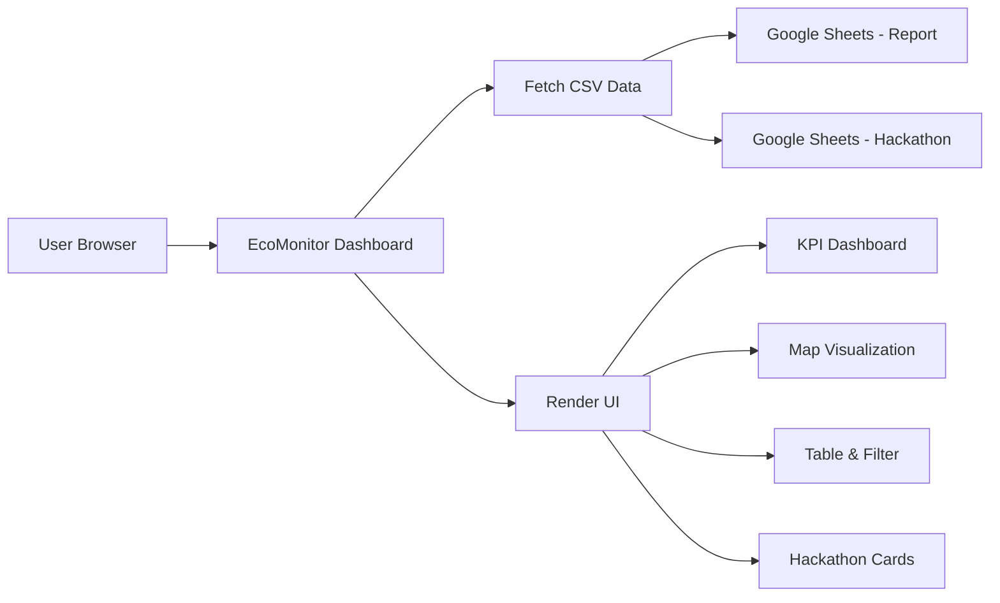
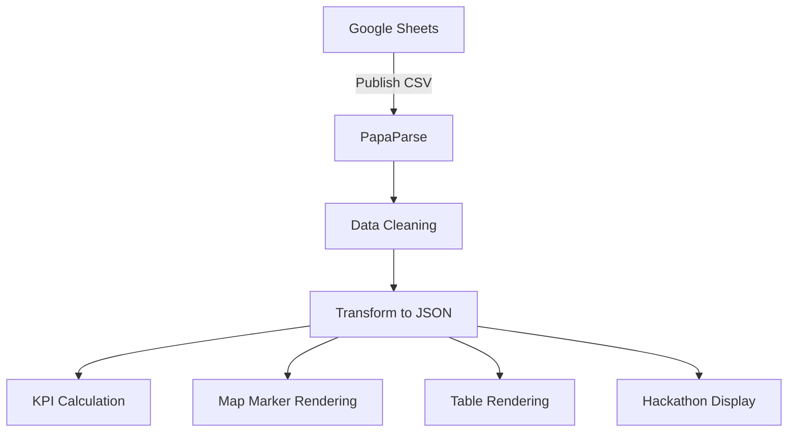

# 🌿 EcoMonitor Dashboard – Mangrove Conservation

Dashboard interaktif untuk memantau aktivitas konservasi mangrove dan ide inovasi (hackathon) berbasis data real-time dari Google Sheets.

---

## 🚀 Features

### 📊 Dashboard Laporan Lapangan

* KPI otomatis:

  * Total sampah terkumpul (kg)
  * Total bibit ditanam
  * Jumlah aktivitas
* Activity feed (maks 30 data terbaru)
* Tabel data:

  * Filter (by tipe kegiatan)
  * Pagination (20 / 50 / semua)
  * Ringkasan hasil kegiatan

---

### 🗺️ Interactive Map (Leaflet)

* Marker berbasis koordinat (lat, long)
* Warna kategori:

  * 🔴 Pembersihan
  * 🟢 Penanaman
  * 🔵 Observasi
* Popup detail aktivitas
* GeoJSON support:

  * Polygon / area mapping
  * Modal peta khusus

---

### 💡 Hackathon Ideas

* Card-based UI
* Struktur:

  * Solusi utama
  * Masalah
  * Signifikansi
* Action:

  * Diskusi
  * Dukung ide

---

### 🔄 Real-time Sync

* Data dari Google Sheets (CSV)
* Parsing via PapaParse
* Status indicator:

  * Loading
  * Success
  * Error

---

## 🧱 Tech Stack

| Layer       | Technology          |
| ----------- | ------------------- |
| Frontend    | HTML + Tailwind CSS |
| Logic       | Vanilla JavaScript  |
| Map         | Leaflet.js          |
| Data Source | Google Sheets (CSV) |
| Parser      | PapaParse           |

---

## 🏗️ System Architecture



---

## 🔄 Data Flow



---

## 📁 Data Structure

### 📌 Sheet: Laporan Lapangan

```
tipe
nama
organisasi
lat
long
geojson
sampah kg
bibit
jarak tanam
jenis
catatan
```

---

### 💡 Sheet: Hackathon

```
nama
organisasi
solusi utama
mengatasi masalah
mengapa signifikan
```

---

## 🔗 Configuration

Update URL Google Sheets di dalam file:

```javascript
const urlReportCsv = "YOUR_REPORT_CSV_URL";
const urlHackathonCsv = "YOUR_HACKATHON_CSV_URL";
```

---

## 🛠️ How to Run

### Option 1 – Direct Open

```
open Dashboard pesisirkita.html
```

---

### Option 2 – Local Server (Recommended)

```bash
python -m http.server 8000
```

Access:

```
http://localhost:8000
```

---

## ⚠️ Important Notes

* Google Sheets harus:

  * Publish to Web (CSV)
  * Public access
* Format angka:

  * Gunakan `.` bukan `,` → contoh: `1.5`
* GeoJSON:

  * Polygon: `[[[lng, lat]]]`
* Data tanpa koordinat → tidak tampil di map

---

## ✨ Best Practices

* Gunakan kategori konsisten:

  * Pembersihan Pesisir
  * Penanaman Mangrove
  * Observasi Lingkungan
* Isi catatan dengan deskriptif (naratif lapangan)
* Gunakan geojson untuk area penting

---

## 📌 Use Cases

* NGO / Environmental Monitoring
* CSR Tracking
* Hackathon Dashboard
* Community-based Conservation
* Data-driven storytelling

---

## 🌱 Future Improvements

* Upload foto kegiatan
* Login system
* Export PDF laporan
* Time-series analytics
* API integration (replace CSV)

---

## 👨‍💻 Author

Built for environmental monitoring & participatory conservation initiatives.

---

## ❤️ Contributing

Feel free to fork & improve!

---

## 🌊 Philosophy

> "What gets measured, gets managed."

Mangrove today, future secured 🌱
